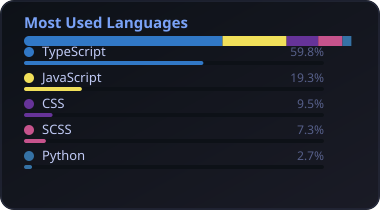

### Hi there 👋

<p align="center">
  <a href="https://github.com/DinonowDev">
    
  </a>
</p>

<p align="center">
  <a href="https://github.com/DinonowDev">
    
  </a>
</p>

<details>
<summary>How this works</summary>

Self-hosted SVG cards — generated by [`scripts/generate-cards.mjs`](./scripts/generate-cards.mjs) and refreshed daily with GitHub Actions. No third-party stats service.

```bash
node scripts/generate-cards.mjs
```

</details>
